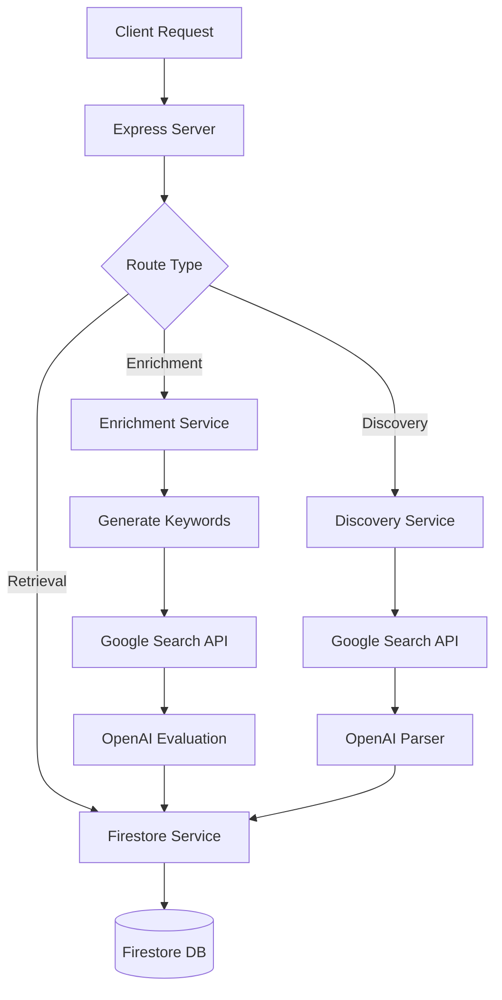

# LinkedIn Enrichment Service

> Express.js microservice for enriching prospect data with LinkedIn profiles using Google Custom Search and OpenAI evaluation.

## 🚀 What Can This API Do?

- **✅ Enrich Prospects** - Find LinkedIn profiles for your leads
- **✅ Discover Prospects** - Search Google for new prospects (up to 100 results)
- **✅ Batch Processing** - Enrich multiple prospects at once
- **✅ Custom Keywords** - Configure search queries per request
- **✅ No Authentication** - Simple HTTP API, no API keys needed for the service itself

## Quick Example

```bash
# Enrich a single prospect
curl -X POST http://localhost:4200/api/enrich \
  -H "Content-Type: application/json" \
  -d '{"prospectId": "your-prospect-id"}'
```

## Technology Stack

- **Runtime:** Node.js 18+ with TypeScript
- **Framework:** Express.js 4.x
- **Database:** Google Cloud Firestore
- **External APIs:** OpenAI GPT-4o-mini, Google Custom Search API

## Getting Started

<div style={{display: 'flex', gap: '10px', flexWrap: 'wrap', margin: '20px 0'}}>
  <a href="/getting-started/quickstart" style={{
    padding: '12px 24px',
    backgroundColor: '#0066cc',
    color: 'white',
    textDecoration: 'none',
    borderRadius: '6px',
    fontWeight: 'bold'
  }}>
    Quick Start Guide →
  </a>
  <a href="/api" style={{
    padding: '12px 24px',
    backgroundColor: '#28a745',
    color: 'white',
    textDecoration: 'none',
    borderRadius: '6px',
    fontWeight: 'bold'
  }}>
    API Reference →
  </a>
  <a href="/playground" style={{
    padding: '12px 24px',
    backgroundColor: '#6c757d',
    color: 'white',
    textDecoration: 'none',
    borderRadius: '6px',
    fontWeight: 'bold'
  }}>
    Try API Playground →
  </a>
</div>

## Features

### Enrichment

Find and validate LinkedIn profiles for prospects stored in Firestore:

- Single prospect enrichment
- Batch enrichment (multiple prospects)
- Direct enrichment (without Firestore lookup)
- Keyword testing (preview search queries)

### Discovery

Discover new prospects from Google search:

- Search Google with custom keywords
- Parse results with OpenAI
- Automatically create prospects in Firestore
- Track batches for auditing

### Data Retrieval

Query and filter enriched data:

- List prospects with filtering
- Get prospects by batch
- View batch statistics
- Filter by enrichment status

## Architecture



## Response Format

All API responses follow this structure:

```json
{
  "success": true,
  "data": { ... },      // on success
  "error": "...",       // on failure
  "message": "..."      // optional details
}
```

## Status Codes

| Code | Description |
|------|-------------|
| `SUCCESS` | Profile found and validated |
| `FALLBACK_LINKEDIN_RESULT` | Used first LinkedIn result |
| `FALLBACK_FIRST_LINK` | Used first Google result |
| `MODEL_NOT_AVAILABLE` | OpenAI couldn't find profile |
| `NO_GOOGLE_RESULTS` | No search results found |
| `GOOGLE_ERROR` | Google API error |
| `OPENAI_ERROR` | OpenAI API error |

[See all status codes →](/guides/error-handling)

## Next Steps

1. **[Quick Start](/getting-started/quickstart)** - Get up and running in 5 minutes
2. **[API Reference](/api)** - Explore all endpoints
3. **[Examples](/examples)** - See real-world usage examples
4. **[Architecture](/architecture)** - Understand the system design
5. **[Deployment](/deployment)** - Deploy to production

## Need Help?

- Check the [API Reference](/api) for detailed endpoint documentation
- See [Examples](/examples) for common use cases
- Review [Troubleshooting](/getting-started/troubleshooting) for common issues
- Visit the [GitHub repository](https://github.com/your-org/linkedin-enrichment-service) for source code
